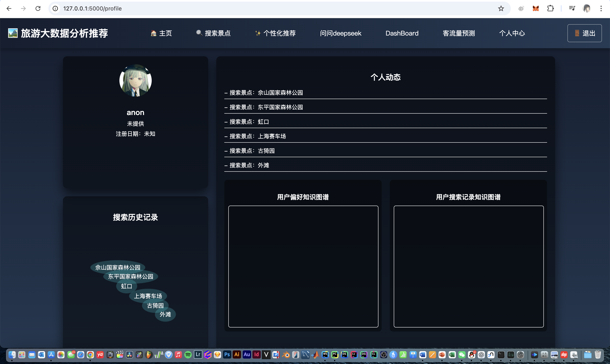
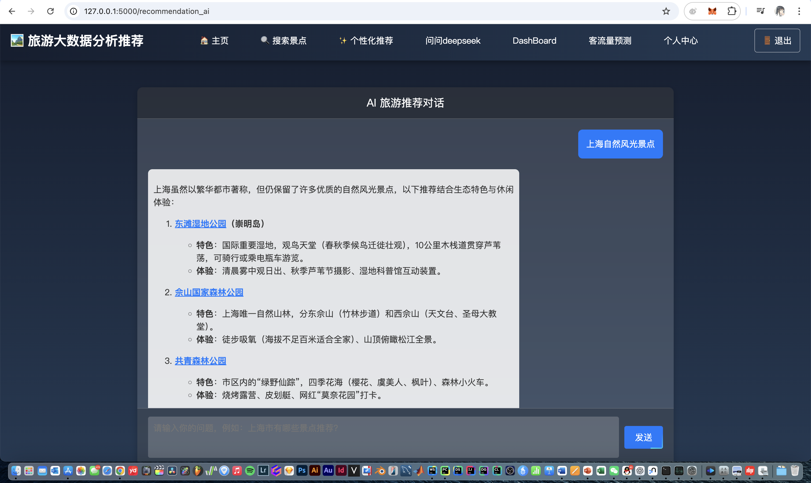
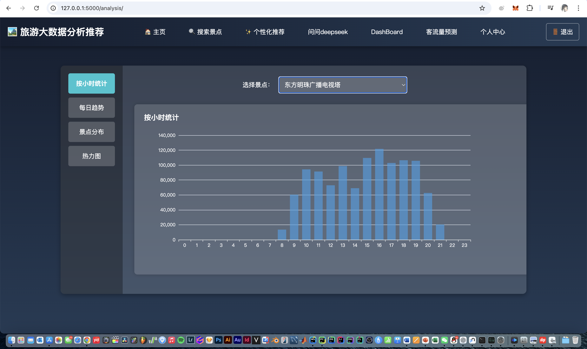

# “乐游上海”--基于flask的上海旅游景点客流的分析及推荐网页

感谢 K 圣开源
## 项目综述
本项目是基于flask开发的大数据分析项目，以web为载体展示。
主体数据分为上海市内景点数据和绝大多数景点的客流量数据。
### 数据来源
```txt
景点：携程；客流量：上海市政府数据平台
```
页面内容及功能涵盖：大数据主页大屏、用户主页及登录注册、景点搜索、景点推荐（基于由搜索记录、用户偏好、景点自身数据构建的知识图谱）、deepseek对话推荐（生成的文本可自动跳转查询）、DashBoard（查看所有数据分析维度）、客流量预测。

## Requirements.txt
```txt
numpy>=1.21.0
pandas>=1.3.0
scipy>=1.7.0
matplotlib>=3.4.0
statsmodels>=0.12.2
```

# 项目各页面及对于功能介绍
## 1. 大数据主页


<br/>
## 2. 用户主页及注册细节
### 登录&注册

<br/>
在注册页面，我们提供了用户自行选择&添加偏好景点类别的选项


<br/>
### 用户主页

用户主页分三个区域:<br/>
左上角展示用户基本信息<br/>
左下角展示用户探访过的景点<br/>
右侧展示用户动态操作和由用户偏好和搜索记录构成的知识图谱<br/>


## 3. 景点搜索及景点详情页

初次进入页面，没有任何记录，页面只有搜索栏容器居中显示<br/>

输入搜索内容后，页面丝滑变为上下结构，跳出基于搜索词的所有模糊搜索结果<br/>
#### 搜索范围为景点数据库表内所有景点<br/>

## 4. 景点个性化推荐及四周的推荐小窗

### 个性化推荐的实现逻辑
我们基于先前注册时预填的用户偏好和每次搜索时后台同步更新的用户搜索记录构建了知识图谱<br/>
#### 知识图谱的节点包括：
- 景点
- 景点类别
- 用户
<br/>
#### 关系包括：
- 景点相似性
- 用户偏好类别
- 用户搜索景点记录
#### 基于以上的景点关系和实时更新的用户侧偏好信息，实现了个性化的 基于知识图谱的 推荐算法技术。
<br/>

## 5. Deepseek对话及景点自动点击跳转

初始的AI对话界面UI<br/><br/>

我们调用了deepseek的API以实现对话推荐功能，以达到为用户分析更多景点细节的目的<br/>
### 不同与普遍的AI对话，我们在对话结果返回后，对文本进行了处理：
- 生成json列表，内容为本轮对话AI推荐的所有景点名称
- 基于json列表，在文本中进行正则匹配，找到回答中所有含景点名称的字段
- 将这些名称的字段改为超链接，点击后自动跳转至项目的搜索页面
- 后端代码将自动填充搜索栏，并执行搜索操作，用户直接可以看到基于点击文本的所有景点查询结果
###

## 6. DashBoard

这个页面是大数据主页大屏的补充，包含所有的原始客流量数据和数据处理维度图表及分析结果<br/>
支持不同景点的各自分析与查询<br/>
## 7. 客流量预测【为了好写预测模型的ppt和报告硬加的】
![还没做好]

<br/>

# 部署流程及细节
## 景点数据爬虫
部署数据库后，运行pachong.py

## 客流量大数据分析
analysis.py【针对客流量数据的图表展示】
process_data
 
## 部署流程
程序入口：app.py
子程序（blueprint）：analysis.py


## MySQL 配置语句

以下是用于创建数据库及相关数据表的 MySQL 配置语句：

```sql
CREATE DATABASE IF NOT EXISTS ctrip_data DEFAULT CHARSET utf8mb4 COLLATE utf8mb4_unicode_ci;

USE ctrip_data;

CREATE TABLE IF NOT EXISTS attractions (
    id INT AUTO_INCREMENT PRIMARY KEY,
    city VARCHAR(100),
    poiName VARCHAR(255),
    displayField VARCHAR(255),
    distanceStr VARCHAR(50),
    latitude DECIMAL(10,6),
    longitude DECIMAL(10,6),
    commentCount INT,
    commentScore FLOAT,
    heatScore FLOAT,
    coverImageUrl TEXT,
    isFree BOOLEAN,
    price DECIMAL(10,2),
    marketPrice DECIMAL(10,2),
    sightCategoryInfo VARCHAR(255),
    tagNameList TEXT,
    sightLevelStr VARCHAR(50),
    UNIQUE KEY unique_spot (city, poiName)  -- 避免插入重复数据
);

CREATE TABLE IF NOT EXISTS attraction_visits (
    id INT AUTO_INCREMENT PRIMARY KEY,
    poiName VARCHAR(255) NOT NULL,   -- 景点名称
    visit_date DATE NOT NULL,        -- 访问日期
    visitors INT NOT NULL,           -- 游客数
    comfort_level VARCHAR(50),       -- 舒适度（如：舒适、较舒适、一般、拥挤）
    capacity INT,       -- 最大承载量（可调整）
    UNIQUE KEY (poiName, visit_date) -- 防止重复数据
);

CREATE TABLE users (
    id INT AUTO_INCREMENT PRIMARY KEY,   -- 用户编号（自动递增）
    username VARCHAR(50) NOT NULL UNIQUE, -- 用户名（唯一）
    password VARCHAR(255) NOT NULL       -- 加密后的密码
);
insert into users value (1,'userA','123456');


CREATE TABLE user_preferences (
    id INT AUTO_INCREMENT PRIMARY KEY,
    user_id INT NOT NULL,
    category VARCHAR(50) NOT NULL,
    FOREIGN KEY (user_id) REFERENCES users(id) ON DELETE CASCADE
);

drop table user_preferences;

CREATE TABLE IF NOT EXISTS user_visits (
    id INT AUTO_INCREMENT PRIMARY KEY,
    user_id VARCHAR(50) NOT NULL,
    poiName VARCHAR(255) NOT NULL,
    UNIQUE KEY (user_id, poiName)  -- 避免重复搜索记录
);


CREATE TABLE IF NOT EXISTS attractions_test (
    id INT AUTO_INCREMENT PRIMARY KEY,
    city VARCHAR(100),
    poiName VARCHAR(255),
    displayField VARCHAR(255),
    distanceStr VARCHAR(50),
    latitude DECIMAL(10,6),
    longitude DECIMAL(10,6),
    commentCount INT,
    commentScore FLOAT,
    heatScore FLOAT,
    coverImageUrl TEXT,
    isFree BOOLEAN,
    price DECIMAL(10,2),
    marketPrice DECIMAL(10,2),
    sightCategoryInfo VARCHAR(255),
    tagNameList TEXT,
    sightLevelStr VARCHAR(50),
    description TEXT,
    UNIQUE KEY unique_spot (city, poiName)  -- 避免插入重复数据
);

ALTER TABLE attractions
ADD COLUMN description TEXT;
```


